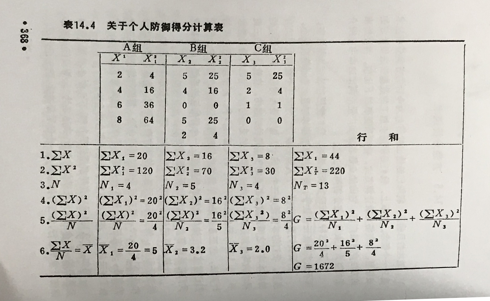

# lect3和lect4作业

## 习题1

24名志愿者随机分成两组，接受降胆固醇试验。 甲组是特殊饮食组，乙组是药物处理组。受试者在实验前后分别测量一次血清胆固醇（mmol/L), 数据如下

甲组 |甲组 |甲组|乙组 |乙组 | 乙组
----|--- | ---|---- | ----|---
受试者 | 试验前 | 试验后 | 受试者 | 试验前 | 试验后
1 | 6.11 | 6 | 1 | 6.9 | 6.93
2 | 6.81 | 6.63 | 2 | 6.4 | 6.35
3 | 6.48 | 6.49 | 3 | 6.48 | 6.41
4 | 7.59 | 7.28 | 4 | 7 | 7.1
5 | 6.42 | 6.3 | 5 | 6.53 | 6.41
6 | 6.94 | 6.64 | 6 | 6.7 | 6.68
7 | 9.17 | 8.42 | 7 | 9.1 | 9.05
8 | 7.33 | 7 | 8 | 7.31 | 6.83
9 | 6.94 | 6.58 | 9 | 6.96 | 6.91
10 | 7.67 | 7.22 | 10 | 6.81 | 6.73
11 | 8.15 | 6.57 | 11 | 8.16 | 7.65
12 | 6.6 | 6.17 | 12 | 6.98 | 6.52

(1) 判断试验前两组对象的血清胆固醇水平是否无差别？
（2）试分别判断甲组和乙组是否有效
（3）试判断两种方法降低胆固醇的方式效果是否有差别？

## 习题2

汽车安全委员会想要评估小型车，中型车还有全尺寸车的安全性能。他们收集了各种车型在撞击时驾驶员头部最大压力值，见下表。请评价三种车型撞击时驾驶员头部最大压力值是否有区别，以0.05为统计检验水平

小型车 | 中型车 | 全尺寸车
------- | ------- | -------
643 | 469 | 484
655 | 427 | 456
702 | 525 | 402

注：方差分析的相关公式

$G=\frac{{(\sum{x_1})}^2}{n_1}+\frac{{(\sum{x_2})}^2}{n_2}+...\frac{{(\sum{x_k})}^2}{n_k}$  （1）

其中$\sum{x_k}$是第k组各项x的和，$n_k$是第k组的项数

$S_b^2=\frac{G-\frac{{(\sum{x_T})}^2}{N_T}}{K-1}$   (2)

其中$\sum{x_T}$是所有组各项的总和，$n_T$是所有组的项数和，K是组数

$S_w^2=\frac{{(\sum{x_T})}^2-G}{n_T-K}$ (3)

统计量F的计算公式：

$F=\frac{S_b^2}{S_w^2}$

其中
- 分子的自由度$\nu_{分子}=K-1$
- 分母的自由度$\nu_{分母}=N_T-K$

根据两个自由度查F临界值表，然后判断在检验水平下（比如p<0.05）是否拒绝H0假设。

计算示例见下图

